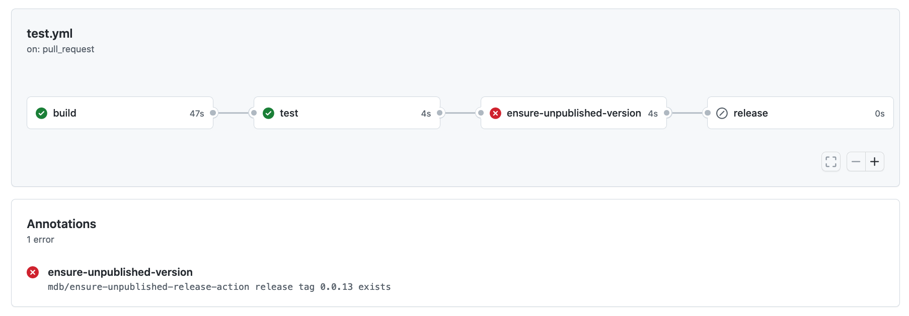

[](https://github.com/mdb/ensure-unpublished-release-action/actions/workflows/test.yml)

# ensure-unpublished-release-action

A GitHub Action that checks if a given GitHub release tag already exists.

In default configuration, `ensure-unpublished-release-action` succeeds if the
provided release tag is unique and does not already exist, and fails if the tag
has already been published as a GitHub release.

The action produces an `exists` output whose value is `true` or `false`.

## Usage

```yaml
- uses: mdb/ensure-unpublished-release-action
  with:
    # Required; a GitHub release tag (typically the release name).
    #
    # Example:
    # tag: ${{ env.VERSION }}
    tag:

    # Required; a GitHub access token (typically `secrets.GITHUB_TOKEN`).
    #
    # Example:
    # token: ${{ secrets.GITHUB_TOKEN }}
    token:

    # Optional; if the specified skip-commit-message-pattern is present in the
    # specified commit-message, do not fail, regardless of whether the release
    # exists or not.
    # If set, requires commit-message.
    #
    # Example:
    # skip-commit-message-pattern: [skip ensure-version]
    skip-commit-message-pattern: 

    # Optional; the commit message (typically ${{ github.event.head_commit.message }}).
    # Required if skip-commit-message-pattern is set.
    #
    # Example:
    # commit-message: ${{ steps.commit-details.outputs.commit-message }}
    commit-message: 

    # Optional; If any of the specified newline-separated list of skip-authors
    # matches the specified author, do not fail, regardless of whether the release
    # exists or not.
    #
    # Example:
    # skip-authors: |
    #   dependabot[bot]
    #   Ian Mackaye
    #   Jeff Nelson
    skip-authors:

    # Optional; the commit author.
    # Required if skip-authors is set.
    #
    # Example:
    # author: ${{ steps.commit-details.outputs.author }}
    author:
```

## Example

```yaml
name: Check that release version does not already exist
on:
  pull_request:

jobs:
  ensure-unpublished-version:
    runs-on: ubuntu-latest
    steps:
      - uses: actions/checkout@v5

      - name: Get package.json version
        run: echo "PACKAGE_VERSION=$(jq -r .version package.json)" >> $GITHUB_ENV

      # Fail the build if package.json's 'version' property specifies
      # a value associated with an already-existing release:
      - uses: mdb/ensure-unpublished-release-action@v1
        with:
          tag: ${{ env.PACKAGE_VERSION }}
          token: ${{ secrets.GITHUB_TOKEN }}
```

Example failure:



See `ensure-unpublished-release-action`'s own `.github/workflows` for an additional example.

## Development

Install dependencies:

```
npm install
```

Format code, lint, compile TypeScript, package code for distribution, and run tests:

```
npm run all
```
